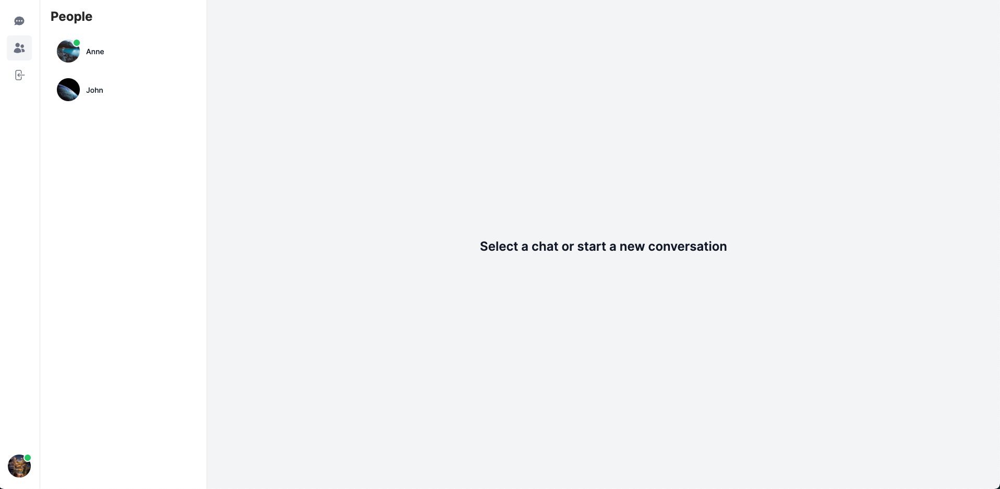
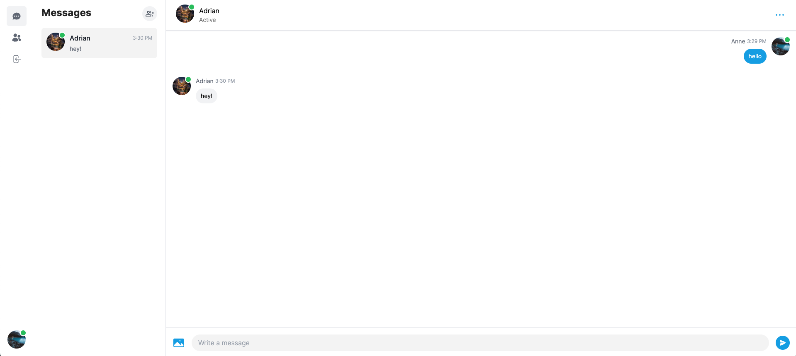

# Chattie

## Introduction

This is a [nextjs](https://nextjs.org/) 13 based chat web application

### Features
1. Register with email/password, github, google
2. Create/delete chats/group chats
3. Profile settings/group chat settings
4. Send text/photo messages

### Technologies
1. (Next 13)[https://nextjs.org/]
2. (Pusher)[https://pusher.com/]
3. Mongodb
4. (Prisma)[https://www.prisma.io/]
5. (Next-Auth)[https://next-auth.js.org/]
6. (Cloudinary)[https://cloudinary.com/]
7. Typescript

### How to run

You need to install latest [nodejs](https://nodejs.org/en) to run the application

1. clone the project

2. Go to the project folder, type:
```
npm install
```
or
```
yarn
```
3. Create .env following the format in .env-sample, add the api keys
```
DATABASE_URL=

GITHUB_ID=
GITHUB_SECRET=

GOOGLE_CLIENT_ID=
GOOGLE_CLIENT_SECRET=

NEXTAUTH_SECRET=

PUSHER_APP_ID=1667107
NEXT_PUBLIC_PUSHER_APP_KEY=
PUSHER_SECRET=

NEXT_PUBLIC_CLOUDINARY_CLOUD_NAME=
```

4. Go to the project folders, type the following command to run
```
npm run dev
```
or
```
yarn dev
```
## Screenshots


User can create new account using email/password, google or github


Show all registered users, click on the user to create conversation


Show all the current conversations, can create group chats, delete chats

Navigate using left sidebar